# Day 2 — Hands-On: Creating an S3 Bucket with Terraform

Even though Day 1 was mostly theory, today I did my first real hands-on exercise: creating an **AWS S3 bucket using Terraform only** — no AWS Console involved.

## What We're Building

A simple S3 bucket, provisioned entirely through Terraform code (`.tf` files), following the full workflow: write code → `init` → `plan` → `apply` → verify → `destroy`.

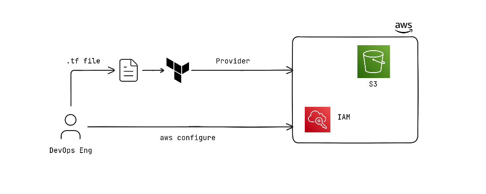

## Step 0: AWS Authentication

Before Terraform can create anything, it needs to authenticate with AWS APIs. There are a few ways to do this:

1. **AWS CLI configuration** — `aws configure`
2. **Environment variables** — `AWS_ACCESS_KEY_ID`, `AWS_SECRET_ACCESS_KEY`
3. **IAM roles** — used automatically when running from EC2 instances or other AWS services
4. **AWS profiles** — named credential profiles (useful when working with multiple AWS accounts)

For this exercise, I first confirmed my AWS access keys were generated and configured correctly:

```
aws configure
```

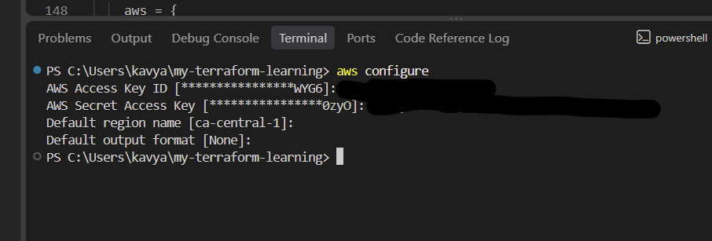

## A Quick Refresher: What is S3?

**S3 (Simple Storage Service)** is AWS's object storage service — it offers scalability, high data availability, security, and strong performance. Today we're just creating an empty bucket, but this is the foundation for storing files, static websites, backups, etc. later on.

## Step 1: The Provider Block (recap from Day 1)

From  **Day 1**, we already know the basic AWS provider configuration:

```hcl
terraform {
  required_providers {
    aws = {
      source  = "hashicorp/aws"
      version = ">= 5.0"
    }
  }
}

provider "aws" {
  region = "us-east-1"
}
```

## Step 2: Finding the Right Resource in the Terraform Registry

Whenever you're not sure how to define a resource, the **Terraform Registry** is the go-to reference:

https://registry.terraform.io/providers/hashicorp/aws/latest/docs/resources/s3_bucket

It gives a sample block like this:

```hcl
resource "aws_s3_bucket" "example" {
  bucket = "my-tf-test-bucket"

  tags = {
    Name        = "My bucket"
    Environment = "Dev"
  }
}
```

## Step 3: Writing `main.tf`

Combining the provider block with the S3 resource block, here's the full `main.tf`:

```hcl
terraform {
  required_providers {
    aws = {
      source  = "hashicorp/aws"
      version = ">= 5.0"
    }
  }
}

provider "aws" {
  region = "us-east-1"
}

# create s3 bucket
resource "aws_s3_bucket" "example" {          # "example" is just an internal reference name for this resource
  bucket = "my-tf-test-bucket-kkat"           # actual S3 bucket name — must be globally unique across all of AWS

  tags = {
    Name        = "My bucket-1"
    Environment = "Dev"
  }
}
```

## Step 4: `terraform init`

This initializes the working directory — downloads the AWS provider plugin and sets things up.

```
terraform init
```

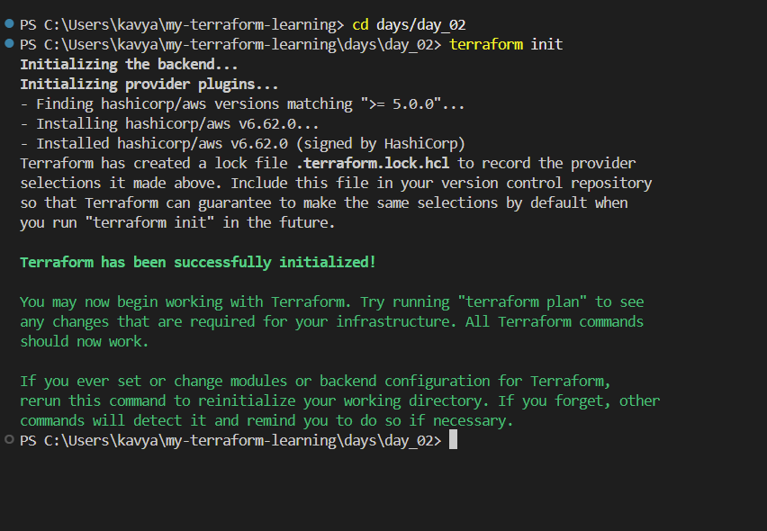

> **Note:** Once you run `init`, Terraform automatically generates a file called `.terraform.lock.hcl`. **Never edit this file manually** — it locks the exact provider versions used, and Terraform manages it for you.

## Step 5: `terraform plan`

This shows what Terraform *will* do, without actually doing it yet — a preview of changes.

```
terraform plan
```

The key thing to look at is the summary line at the end, which shows 3 numbers:

**Plan: to add, to change, to destroy.**

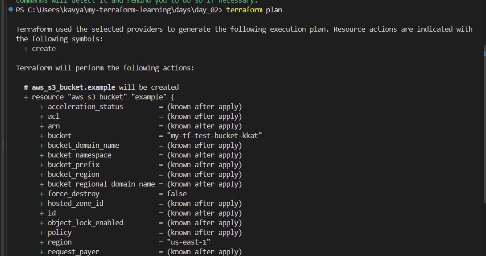
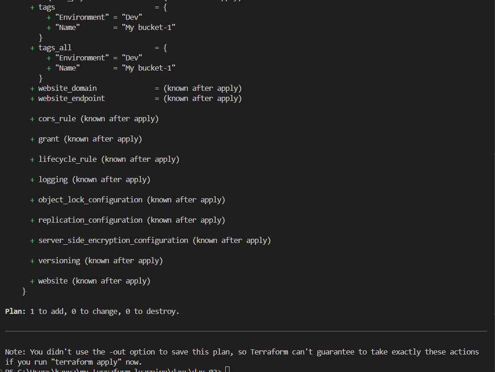

## Step 6: `terraform apply`

This is like a "dry run with a confirmation step" — Terraform shows the plan again and asks for permission before actually creating anything.

```
terraform apply
```

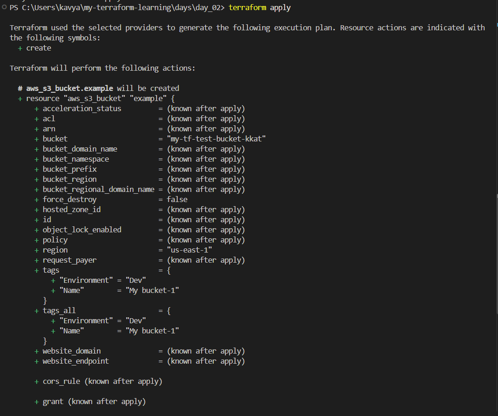
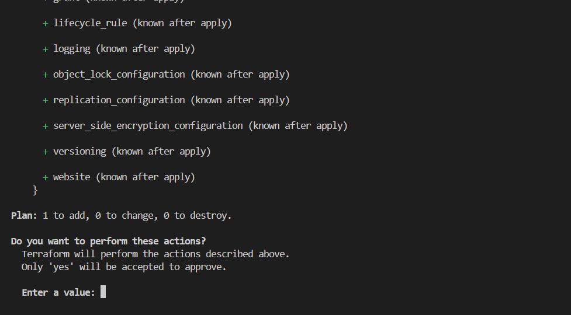

> **Note:** This step also generates a file called `terraform.tfstate` — the **state file**. This file is sensitive/secret — it should **not** be accessible to everyone. Only people who are allowed to make infrastructure changes should have access to it, since it can contain sensitive resource details.

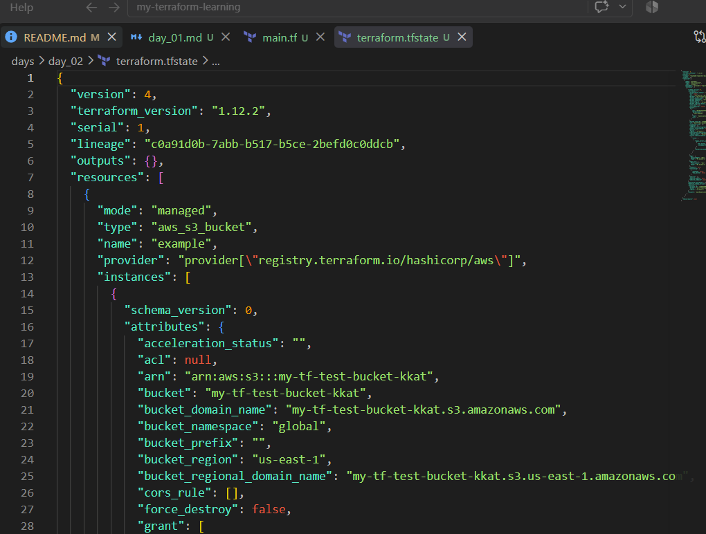

**Important gotcha:** the confirmation prompt is **case-sensitive**. You must type exactly `yes` (lowercase). Typing `Yes` (capital Y) will cancel the apply.

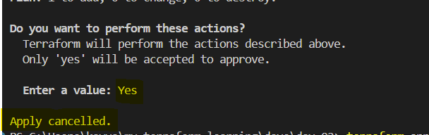

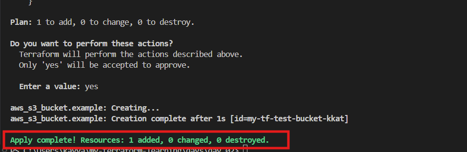

### Verifying in the AWS Console

Even though we created everything through Terraform (no console clicking), it's good practice to check the result in the AWS Console:

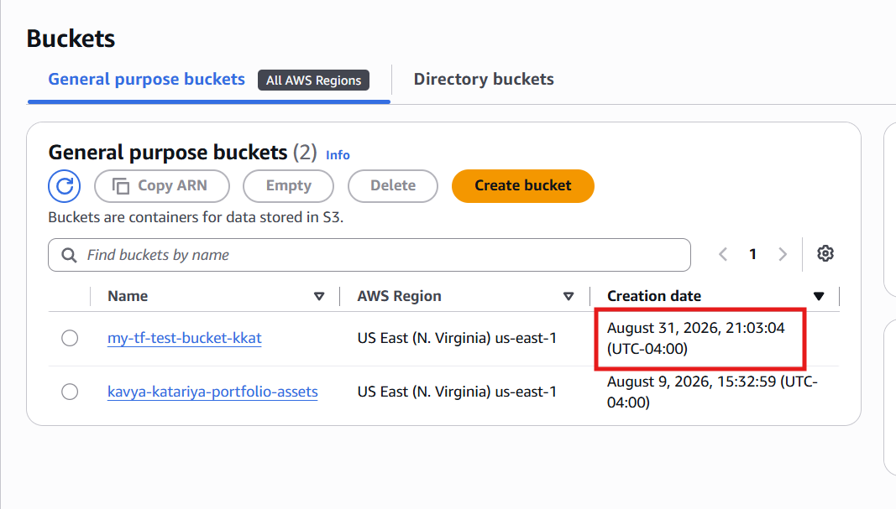

### Skipping the Confirmation Prompt

If you don't want to be asked for confirmation every time (useful once you trust your plan, e.g. in automation/CI pipelines), you can use:

```
terraform apply --auto-approve
```

## Step 7: `terraform destroy`

When you're done and want to clean up (delete the bucket / all resources created by this config):

```
terraform destroy
```
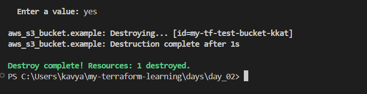
This removes everything Terraform created, based on the current state file.

## Key Takeaways

- Terraform needs valid AWS credentials before it can do anything — set these up first with `aws configure` (or another auth method).
- The Terraform Registry is the best reference for correct resource syntax for any provider.
- `.terraform.lock.hcl` (created by `init`) and `terraform.tfstate` (created by `apply`) are both auto-generated — don't hand-edit the lock file, and treat the state file as sensitive.
- `terraform plan` is a safe preview — it changes nothing.
- `terraform apply` requires typing `yes` (lowercase, exact match) to confirm — or use `--auto-approve` to skip the prompt.
- `terraform destroy` tears down everything Terraform created for that configuration.
