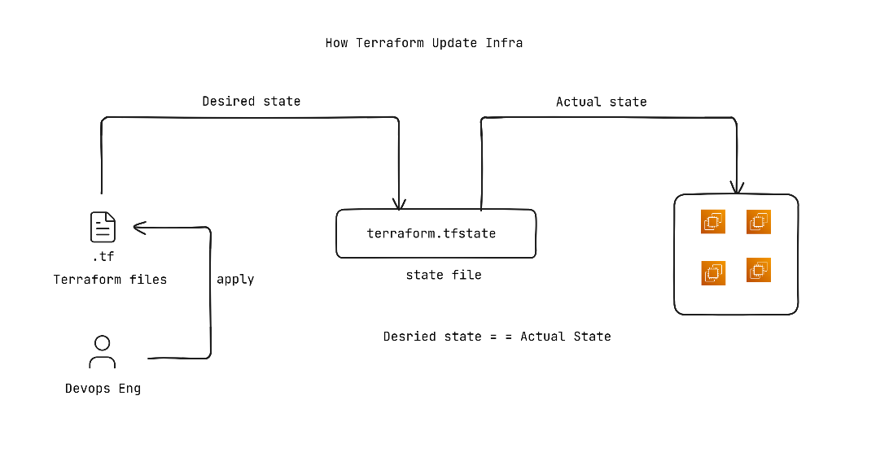
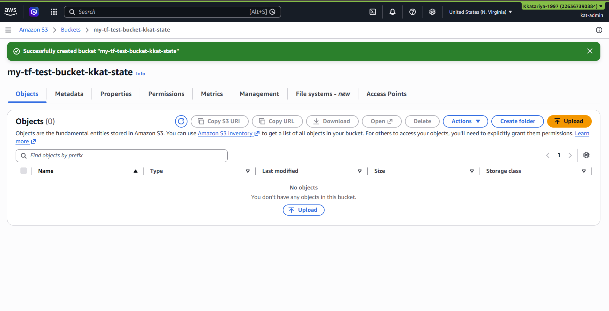
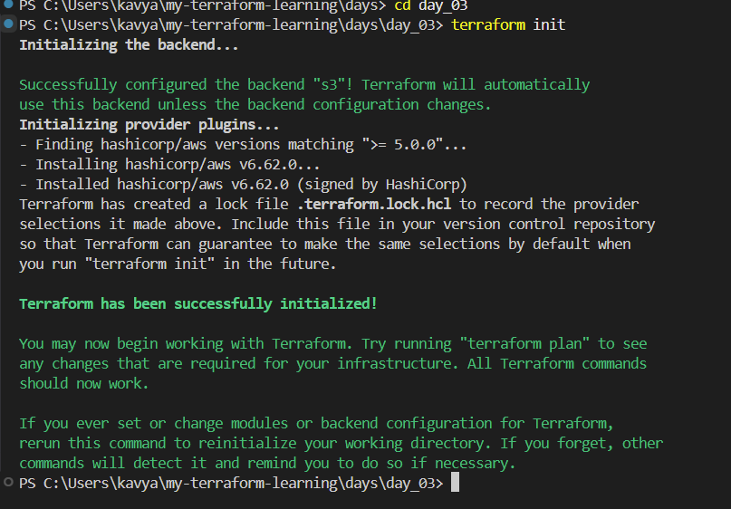
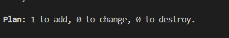
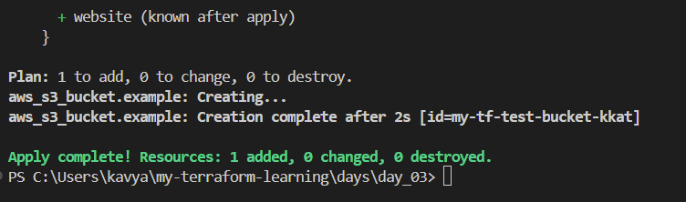
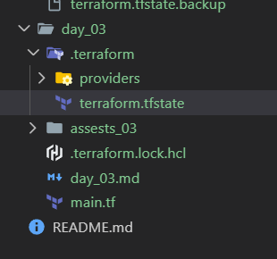
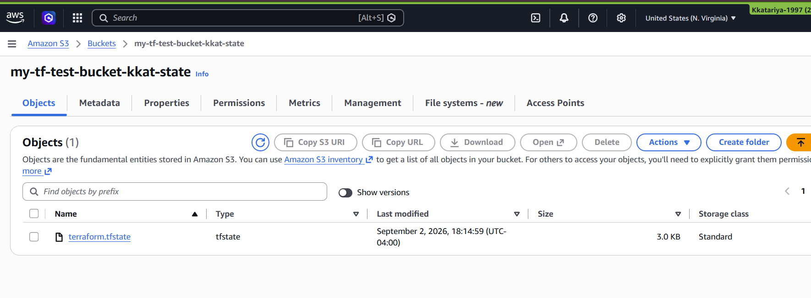
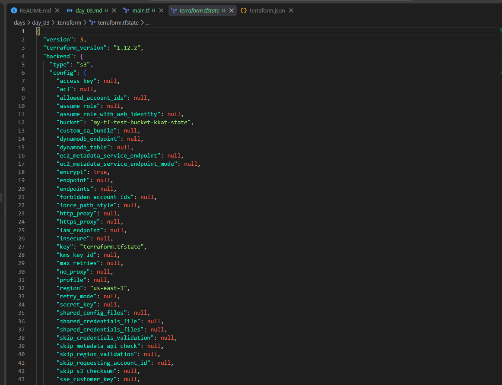
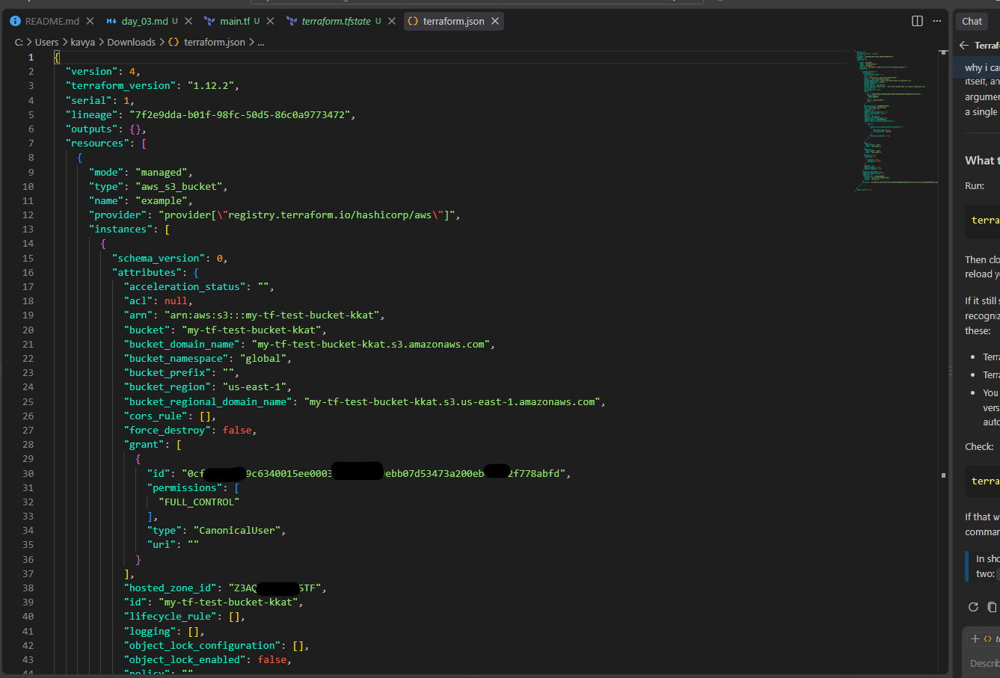

# Day 3 — Terraform State & Remote Backends

Today's focus: understanding the **Terraform state file** in depth — what it is, why Terraform needs it, and how to store it *remotely* in an S3 bucket instead of on your own laptop, plus a newer feature called **state locking**.

Reference: https://developer.hashicorp.com/terraform/language/state

## What Is Terraform State?

Think of the state file as Terraform's **memory**. Every time Terraform creates, updates, or deletes something in AWS, it writes down what it did in a file called `terraform.tfstate`.

Terraform needs this "memory" to work at all — without it, Terraform would have no way of knowing which real-world AWS resources correspond to which blocks in your `.tf` files, or what already exists versus what still needs to be created.

## Why Does Terraform Need State?

The state file's main job is to store the **link between your code and the real resources in AWS**. When Terraform creates something (say, an S3 bucket), it records that resource's real AWS identity against the block in your configuration that created it. Then, next time you run Terraform, it can look at that resource again and figure out whether it needs to update it, leave it alone, or delete it.

In short, the state file lets Terraform:

- Map your `.tf` configuration to real resources that actually exist in AWS
- Keep track of extra metadata about each resource
- Work faster, especially on large infrastructures, since it doesn't have to check every resource in AWS from scratch every time

## Where Is State Stored by Default?

By default, Terraform stores state **locally**, on your own machine, in two files:

- `terraform.tfstate` — the current state
- `terraform.tfstate.backup` — a backup of the previous state

This requires no setup, but it has real downsides:

- **No collaboration** — if you're working with a team, everyone needs their own copy, which quickly gets out of sync
- **Risk of loss** — if you lose that local file (laptop crash, accidental delete), Terraform loses track of everything it manages

This is why, once you move past solo learning projects, it's recommended to store state in a **remote backend** instead (more on this below).

> **Important:** Never store your state file in version control (like a GitHub repo) or in any storage that doesn't support Terraform's locking and access-control features — doing so risks losing your state or leaking secrets that may be stored inside it.

## How Terraform Keeps Infrastructure Up to Date



The diagram above sums up the whole loop: you (the Cloud/DevOps engineer) write `.tf` files describing the **desired state**, then run `terraform apply`. Terraform reads that desired state, checks it against the **actual state** it has on record in `terraform.tfstate`, and pushes whatever changes are needed to the real infrastructure — the end goal always being **desired state == actual state**.

- **Goal:** keep the *actual* state (what's really in AWS) the same as the *desired* state (what your `.tf` files describe)
- **Where actual state lives:** the `terraform.tfstate` file
- **The process:** every time you run Terraform, it compares the current state against your configuration
- **What it changes:** only the resources that actually need to change — it doesn't touch things that already match

This comparison happens every time you run `terraform plan` or `terraform apply`.

## What's Inside the State File

The state file is a **JSON file** containing:

- Resource metadata and current configuration
- Resource dependencies (what depends on what)
- Provider information
- The actual attribute values of each resource

> **Note:** Because of everything listed above, the state file should be treated as **confidential**. It should never be exposed publicly or left accessible on a server without proper access control — anyone who can read it can potentially see sensitive details about your infrastructure.

## State File Best Practices

1. **Never edit the state file manually**
2. **Store the state file remotely** (not just on your local machine)
3. **Enable state locking** to prevent two people/processes from writing to it at the same time
4. **Back up state files** regularly
5. **Use separate state files** for different environments (e.g., dev vs. prod)
6. **Restrict access** to state files — they contain sensitive data
7. **Encrypt state files** both at rest and in transit

## What Is a Remote Backend?

A **backend** in Terraform defines *where* Terraform stores its state data. A **remote backend** just means: instead of keeping `terraform.tfstate` on your own machine, it's stored somewhere shared — for example, in an S3 bucket, with limited IAM (AWS permissions) access.

### When to Use a Remote Backend

Use a remote backend once **multiple people or teams** need access to the same infrastructure's state — which is basically any real team setting, as opposed to solo learning.

### Remote Backend Benefits

- **Collaboration** — team members can all read/write the same shared state
- **Locking** — prevents two people from making changes to the state at the same time
- **Security** — supports encrypted storage and access control
- **Backup** — automatic versioning and backup of state
- **Durability** — highly available storage (won't disappear if your laptop dies)

### AWS Remote Backend — the Pieces Involved

- **S3 bucket** — stores the actual state file
- **S3 native state locking** — uses S3's "conditional writes" feature to lock the state (introduced in Terraform 1.10)
- **IAM policies** — control exactly who/what is allowed to access the backend

## S3 Native State Locking

**State locking** means: while one person is running `terraform apply`, Terraform "locks" the state file so nobody else can run a conflicting operation at the same time — this protects against two people corrupting the state simultaneously. It's optional, but a good practice.

Starting with **Terraform 1.10** (released in 2024), you no longer need a separate DynamoDB table to get state locking — Terraform can now do it directly using **S3 Conditional Writes**.

### How It Works

1. When Terraform needs to acquire a lock, it tries to create a lock file in S3
2. S3's conditional-write feature checks if that lock file already exists
3. If it already exists → the write fails, which stops others from making concurrent changes
4. If it doesn't exist → the lock file is created, and the lock is acquired
5. Once the operation finishes, the lock file is deleted (it shows up as a "delete marker" if S3 versioning is on)

### Why This Is Better Than the Old Way (DynamoDB)

Previously, state locking required a separate AWS DynamoDB table alongside your S3 bucket. That meant:

- An extra AWS service to set up and maintain
- More complex IAM permissions to manage
- Extra cost for DynamoDB read/write operations

DynamoDB-based locking is now **discouraged** and may eventually be deprecated in favor of the newer S3-native approach.

## Setting Up a Remote Backend

### Step 1: Create an S3 Bucket for State Storage

Create an S3 bucket with **versioning** and **encryption** enabled — this bucket will hold your Terraform state file. (You can do this manually in the console, or automate it with a small AWS CLI script.)

### Step 2: Add a Backend Block to Your Configuration

```hcl
 backend "s3" {
    bucket = "my-tf-test-bucket-kkat-state"
    key    = "terraform.tfstate"
    region = "us-east-1"
    use_lockfile = true
    encrypt = true
  }
```

**What each line means:**

- `bucket` — the S3 bucket name where the state file will live
- `key` — the path/filename inside that bucket for this particular state file
- `region` — the AWS region the bucket is in
- `use_lockfile` — turns on S3 native state locking
- `encrypt` — turns on server-side encryption for the state file

> **Important:** S3 versioning **must** be enabled on the bucket for native state locking to work correctly.

### (Optional) How You Can Test State Locking Yourself

If you want to see the lock in action:

1. **Terminal 1:** run `terraform apply`
2. **Terminal 2:** while that's still running, try `terraform plan` or `terraform apply`
3. **Expected result:** the second command should fail with something like:
   ```
   Error: Error acquiring the state lock
   Error message: operation error S3: PutObject, https response error StatusCode: 412
   Lock Info:
     ID:        <lock-id>
     Path:      <bucket>/<key>
     Operation: OperationTypeApply
     Who:       <user>@<hostname>
   ```
4. While the operation is running, you'll briefly see a `.tflock` file appear in the S3 bucket
5. Once it's done, that lock file is automatically removed

### Migrating an Existing Local State to a Remote Backend

```bash
# Re-initialize with the new backend configuration
terraform init

# Terraform will prompt to migrate existing state — answer 'yes' to copy it over

# Confirm the state is now remote
terraform state list
```

### Useful State Commands

```bash
# List all resources tracked in the current state
terraform state list

# Show detailed info about one resource
terraform state show <resource_name>

# Remove a resource from state WITHOUT destroying it in AWS
terraform state rm <resource_name>

# Move a resource to a different address in the state
terraform state mv <source> <destination>

# Pull and display the current remote state
terraform state pull
```

### Security Considerations

- **S3 bucket policy** — restrict access to authorized users only
- **S3 versioning** — required for locking, and also gives you rollback capability
- **Encryption** — enable server-side encryption on the bucket
- **Access logging** — enable CloudTrail for an audit trail of who accessed what
- **IAM permissions** — grant only the minimum S3 permissions needed (no DynamoDB permissions required with the native locking approach)

### Common Issues

- **State lock error** — if a Terraform process crashes mid-run, the lock file can get stuck. Delete it manually from S3, or run `terraform force-unlock <lock-id>`
- **Permission errors** — double-check IAM permissions for S3 access
- **Versioning not enabled** — native locking will not work correctly without it
- **Region mismatch** — your backend region should match your provider's region
- **Bucket names** — S3 bucket names must be globally unique across all of AWS
- **Terraform version** — requires Terraform 1.10+ for S3 native locking (1.11+ recommended for the stable release)

## What I Actually Did (Hands-On)

1. Manually created an S3 bucket named `my-tf-bucket-kkat-state`, with **versioning enabled**.

   

2. Ran `terraform init` to initialize with the new backend configuration.

   ```
   terraform init
   ```

   

3. Ran `terraform plan` to preview the changes.

   ```
   terraform plan
   ```

   

4. Ran `terraform apply --auto-approve` to apply without being prompted for confirmation.

   ```
   terraform apply --auto-approve
   ```

   

5. At this point, Terraform created a `terraform.tfstate` file. I confirmed it didn't contain any secrets locally, since the actual state is stored in the S3 backend rather than on my machine.

   

- In S3 bucket: 
 

6. I downloaded the file in s3, and the file I have locally. The local file `terraform.tfstate` do not have much details, and the in S3 is suppose to be confidential. 

- Local file: 
 

- File in s3 (JSON)
 


## Key Takeaways

- The state file is how Terraform "remembers" what it has already created — it maps your code to real AWS resources.
- Storing state locally works for solo learning, but doesn't scale to teams — a **remote backend** (like S3) solves that.
- As of Terraform 1.10+, you can get state locking directly from S3 (via conditional writes) — no more need for a separate DynamoDB table.
- The state file must always be treated as **confidential** — never commit it to Git, and restrict who can access it. (Even I am not attaching here 😉)
- `terraform state list`, `show`, `rm`, `mv`, and `pull` are useful commands for inspecting and managing state directly.
